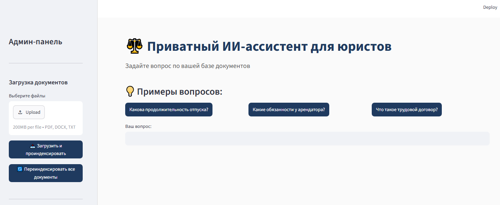

# Private AI Assistant for Lawyers (Self-hosted RAG)

**Приватный ИИ-ассистент для юристов и бизнеса**

Решение для юридических фирм и бизнеса, которое позволяет безопасно искать ответы по внутренней базе документов. Полностью автономное: данные не покидают сервер.

## Возможности
- Загрузка документов: PDF, DOCX, TXT
- Смысловой поиск (RAG) вместо точного совпадения слов
- Ответы с цитированием источника (файл, пункт, статья)
- Админ-панель: добавление, удаление, переиндексация
- Поддержка русского языка

## Технологии
- Docker
- Ollama (Qwen 2.5)
- Qdrant
- sentence-transformers
- Streamlit

## Статус
MVP готов, ищу первых клиентов.

## Скриншоты

## Презентация
[Скачать презентацию (PDF)](Презентация RAG-проекта.pdf)
